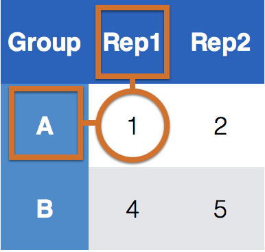
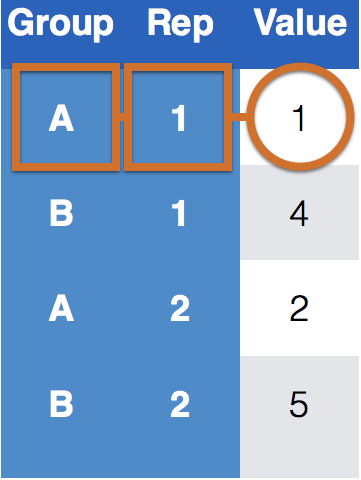
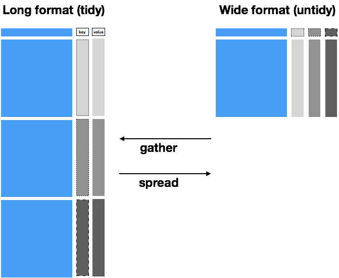
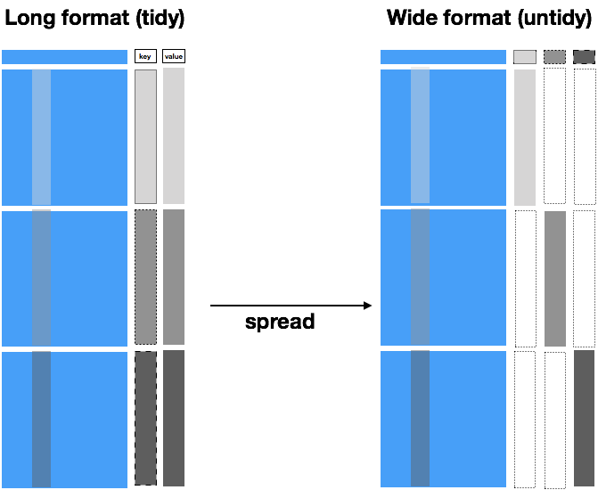

```{r setup, include=FALSE}
knitr::opts_chunk$set(echo = TRUE)
library(tidyverse)
data(french_fries, package="reshape2")
```
# The `tidyr` package

## What is tidy data?

> Happy families are all alike; every unhappy family is unhappy in its own way.<br>
Leo Tolstoy

- Resource: follow along tidyr vignette 
- available as 
`vignette("tidy-data", package="tidyr")`
- vignette is version of the [tidy data paper](https://www.jstatsoft.org/article/view/v059i10) with updated code

## Outline

- Different sources of messiness
- Key-Value pairs
- `tidyr`: `spread` and `gather`


## Data is usually in a spreadsheet format, but ...

there's different ways of encoding the same information:

Option #1
```{r echo = FALSE}
read.csv("data/preg.csv")
```

Option #2
```{r echo = FALSE}
read.csv("data/preg2.csv")
```

Neither #1 nor #2 are "clean" versions of the data: observed information is part of the data structure; some implicit information is assumed

## Sources of Messiness

1. Column headers are values, not variable names.<br>
e.g. *treatmenta, treatmentb*
2. Multiple variables are stored in one column.<br>
e.g. *Fall 2015, Spring 2016* or *"1301 8th St SE, Orange City, Iowa 51041
(42.99755, -96.04149)", "2102 Durant, Harlan, Iowa 51537
(41.65672, -95.33780)"*
3. Multiple observational units are stored in the same table.
4. A single observational unit is stored in multiple tables.

## Tidy data


1. Each variable forms one column.
2. Each observation forms one row.
3. Each type of observational unit forms a table.

## Clean version of the example

```{r echo = FALSE}
preg2 <- read.csv("data/preg2.csv")
preg2 %>% gather(key = patient, value = score, 2:4) %>% 
  mutate(patient = gsub("\\.", " ", patient))
```

- `treatment` and `patient` uniquely describe a single row in the dataset.
- `treatment` and `patient` are **key variables**,
- `score` is a **measurement variable**
- this makes `treatment-patient` and `score` a **key-value pair**


## Key-value pairs (KVP)
 
**Key-Value pairs** (KVP) - also *attribute-value*, *field-value*, *name-value*:
abstract data representation that allows a lot of flexibility  

One way of telling whether a data set is tidy is to check that all keys for a value are aligned in one row:

| | |
|:------------- |:------------- | 
| | |
|  |      | 
|Untidy data | Tidy data |

## Tidying data - Plan of attack

Very few functions are needed for tidying data:

- Messy (1): `tidyr` functions `gather` and `spread`.  
`gather (data, key, value, ...)`: take multiple columns and collapse into key-value pairs <br>
`spread (data, key, value, fill = NA)`: spread a key-value pair across multiple columns.
- Messy (2): `tidyr` function `separate (data, col, into, sep = "[^[:alnum:]]+")`:
separate one column into multiple columns
- Messy (3): `dplyr` - some combination of the functions discussed previously
- Messy (4): `dplyr` functionality `join` (and friends) to combine multiple data sets 

## French fries data

```{r}
data(french_fries, package="reshape2")
```

- data from sensory experiment conducted at Iowa State University in 2004
- investigators were interested in comparing effects of three different fryer oils on taste of fries

```{r}
french_fries %>% head()
```


## Gather

```{r}
ffm <- french_fries %>% gather(key = scale, value = score, 5:9)
ffm
```

## Spread

```{r}
ffm %>% spread(key = rep, value = score)
```

##

```{r}
ffm %>% spread(key = rep, value = score) %>%
  ggplot(aes(x = `1`, y = `2`)) + geom_point() +
  facet_wrap(~scale) + geom_abline(colour = "grey50")
```

## Your turn {.white}


<span style="color:white">For this your turn use the `french_fries` data from the `reshape2` package: `data("french_fries", package="reshape2")` </span>

- <span style="color:white">Use `gather` from the `tidyr` package to combine the different scales for assessing french fries into a single variable. Call the key-value pair "scale" and "score". </span>
- <span style="color:white">Use `spread` from the `tidyr` package to get a format in which you can directly compare values from week 1 to week 10. Plot a scatterplot of values in week 1 against week 10. Facet by treatment and scale, color by individuals   and use different shapes for the replicates. Is there a pattern visible?</span>

```{r}
head(french_fries)
ff1 = french_fries %>% gather(key = scale, value = score, 5 : 9)
head(ff1)

ff2 = ff1 %>% spread(key = time, value = score)
head(ff2)
ff2 %>% ggplot(aes(x = `1`, y = `10`)) + geom_point(aes(color = subject, shape = factor(rep))) + facet_grid(treatment ~ scale)
```


## Your turn {.white}


<span style="color:white">For this your turn use the `fbiwide` data from the `classdata` package: `data("fbiwide", package="classdata")` </span>

- <span style="color:white">Use `gather` from the `tidyr` package to combine the variables for the different types of crimes into one variable. Call the key-value pair "Type" and "Incidences". Compute a crime rate</span>
- <span style="color:white">Only consider crime rates for Iowa and Minnesota. Use `spread` to create incidence columns for each of these states. Plot crimes in Iowa against crimes in Minnesota, colour by type of crime. Note: you need to exclude some variables. </span>

```{r}
head(fbiwide)
fbi1 = fbiwide %>% gather(key = Type, value = Incidences, 6 : 14)
fbi1 = fbi1 %>% mutate(Rate = Incidences / Population * 70000)
fbi2 = fbi1 %>% filter(State %in% c("Iowa", "Minnesota"))
fbi3 = fbi2 %>% select(-Abb, -Population, -Violent.crime, -Incidences) %>% spread(key = State, value = Rate)
fbi3 %>% ggplot(aes(x = Iowa, y = Minnesota)) + geom_point(aes(color = Type))
```

## Spread works as inverse of gather



## Front part is not identical - not collapsible



## Where `spread` is tricky

- `spread` is the (almost) inverse operation of `gather`
- when we use `gather` the key information is duplicated
- when using `spread` we need to make sure that the information outside the key and value is identical for all levels (and combinations of levels) of the `key` variable.
- If the info is not identical across levels, missing values are introduced into the new data set.

## `spread` in the example

```{r, message=FALSE, warning=FALSE}
library(classdata)
fbi %>% filter(Year==2014, State %in% c("Iowa", "Minnesota"), Type=="Burglary")
```
Other state specific values don't allow spread to collapse the front part and introduce missing values:

```{r}
fbi %>% filter(Year==2014, State %in% c("Iowa", "Minnesota"), Type=="Burglary") %>% 
  spread(State, Count)
```

## fixing `spread` in the example

Negative selection of all state specific variables gets the example to "work": 

```{r}
fbi %>% filter(Year==2014, State %in% c("Iowa", "Minnesota"), Type=="Burglary") %>% 
  select(-Abb, -Population) %>% 
  spread(State, Count)
```


