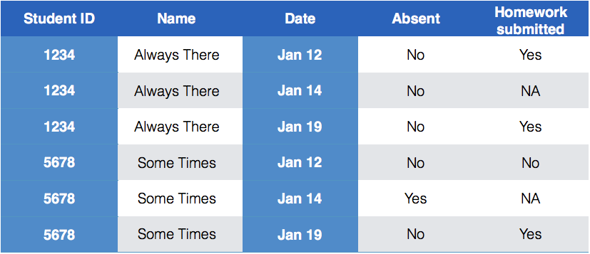
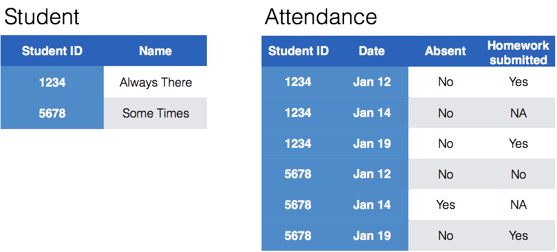

```{r setup, include=FALSE}
knitr::opts_chunk$set(echo = TRUE)
library(tidyverse)
```

# Dealing with Messy (3) 

## Reminder

Messy (3): *Multiple observational units are stored in the same table.*

# Keys and Measurements

## Finding your keys - Example (1)

100 patients are randomly assigned to a treatment for heart attack, measured 5 different clinical outcomes.

## Finding your keys - Example (1)

100  patients are randomly assigned to a treatment for heart attack, measured 5 different clinical outcomes.

- key: patient ID
- factor variable (design): treatment
- measured variables: 5 clinical outcomes

## Finding your keys - Example (2)

Randomized complete block trial with four fields, four different types of fertilizer, over four years.  Recorded total corn yield, and fertilizer run off

## Finding your keys - Example (2)

Randomized complete block trial with four fields, four different types of fertilizer, over four years.  Recorded total corn yield, and fertilizer run off

- key: fields, types of fertilizer, year
- measurement: total corn yield, fertilizer run off


## Finding your keys - Example (3)

Cluster sample of twenty students in thirty different schools.  For each school, recorded distance from ice rink.  For each student, asked how often they go ice skating, and whether or not their parents like ice skating


## Finding your keys - Example (3)

Cluster sample of twenty students in thirty different schools.  For each school, recorded distance from ice rink.  For each student, asked how often they go ice skating, and whether or not their parents like ice skating

- key: student ID, school ID
- measurement: distance to rink, #times ice skating, parents' preference


## Finding your keys - Example (4)

For each person, recorded age, sex, height and target weight, and then at multiple times recorded their weight

## Finding your keys - Example (4)

For each person, recorded age, sex, height and target weight, and then at multiple times recorded their weight

- key: *patient ID*, date
- measurement: *age, sex, height, target weight*, current weight

*only patient ID is needed for variables in italics*

## Messy (3)

Messy (3): *Multiple observational units are stored in the same table.*

What does that mean? The *key is split*, i.e. for some values all key variables are necessary, while other values only need some key variables.




## Why do we need to take care of split keys?

- Data redundancy introduces potential problems (same student *should* have the same student ID)
- to check data consistency, we split data set into parts - this process is called *normalizing*
- normalization reduces overall data size
- useful way of thinking about objects under study


## Tidying Messy (3)

Splitting into separate datasets:



## Example: Box office gross

The-Numbers website publishes [weekly charts](http://www.the-numbers.com/weekend-box-office-chart) of the gross income of all movies playing across the US. A set of cleaned data called `box` with movies for the last five years is available in the `classdata` package.

```{r, warning=FALSE, message=FALSE}
# devtools::install_github("heike/classdata")
library(classdata)
head(box, 4)
```

What are the key variables? Why is the key split?

## Keys and measurements

- Key variables: `Movie` name,  `Date` and `Distributor`. 
- Measurement variables: `Gross`, `Thtrs.`
- All other variables are derived from these variables
- good practice: re-calculate the derived variabes to check for consistency. 

## Taking care of the split key

Plan: separate movie information from box office information

Idea for separation: we want to get a set of movies together with their Distributor and ideally their release date (which we do not have).

Instead of release date we want to get the date of the first time that we see a movie in the boxoffice.

Let's also keep track of how many weeks a movie has been released at that time (should be 1 - when will it be different for sure?)

## Your turn {.white}


<span style="color:white">For this your turn use the `box` data from the `classdata` package </span>

- <span style="color:white">Big goal: we want to create a new dataset `movie` that consists of movie, distributor, date of first time the movie shows up in the box office, and the number of weeks the movie has been released at that time.</span>
- <span style="color:white">First: what are the key variables for the new dataset?</span>
- <span style="color:white">Second: for the key variable(s) use `summarize` to find the first time a movie shows up in the box office and find the related number of weeks. </span>

<br><br><br><br><br><br><br><br>

## Key variables 

Does `Movie` uniquely describe a movie?

```{r}
movies <- box %>% select(Movie, Distributor) %>% unique()
```

Does that make a movie unique?

```{r}
movies %>% count(Movie) %>% arrange(desc(n))
```

## Movie data - take 2


Get the Week info  for the first time we see  each Movie and Distributor combo:

```{r}
movies <- box %>% group_by(Movie, Distributor) %>% 
  summarise(
    firstDate = Date[which.min(Week)], 
    firstWeek = min(Week, na.rm=TRUE),
    theater = Thtrs.[which.min(Week)])
head(movies)
```

## Looking into inconsistencies

```{r}
movies %>% group_by(Movie) %>% mutate(n = n()) %>% arrange(desc(n))
```


## Using IMDb

- Girlhood is the name of two movies - one that was released in 2003, one in 2014; most likely the Oct 4 boxoffice mention is only mistakenly referring to the 2003 movie
- Mama Africa refers to two movies, one released in 2002, one in 2011; likely the duplicate  on Jan 19 is erroneous, but we still don't know which of the two movies is showing (in 1 theater)

```{r}
box %>% filter(Movie=="Mama Africa")
```

## 

- Normalization helps identify inconsistencies in data
- Checking up on inconsistencies is a lot of manual labor
