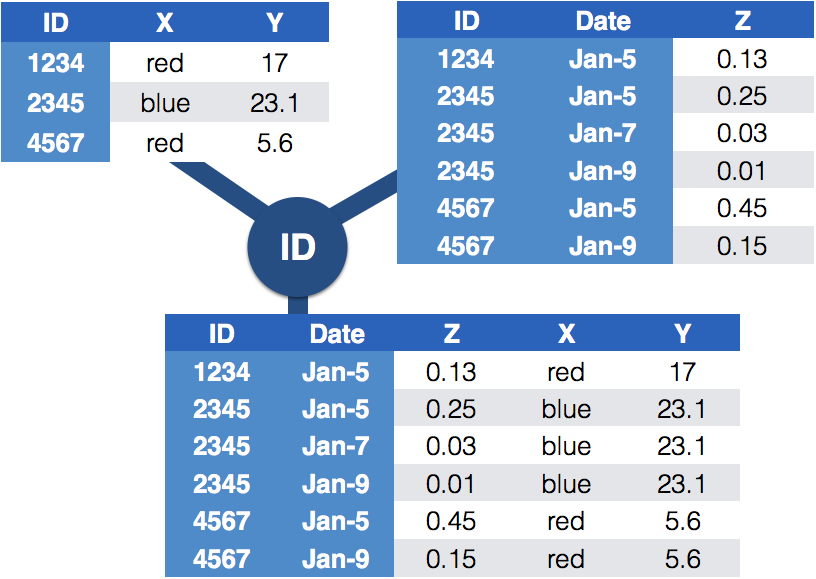

```{r setup, include=FALSE}
knitr::opts_chunk$set(echo = TRUE)
library(tidyverse)
```
# Dealing with Messy  (4)


## Messy (4)

Messy (4): *Values for a single observational unit are stored across multiple tables.*

After data are normalized by splitting, we want to de-normalize again by *joining* datasets.

## Example: Lahman package

Sean Lahman is a database journalist, who started databases of historical sports statistics, in particular, the Lahman database on baseball.

```{r}
library(Lahman)
LahmanData
```

## Lahman database

The Lahman database consists of 24 data frames that are linked by `playerID`. <br>
This is clean, but not very readable. <br>
The `People` table includes names and other attributes for each player. <br>
*Joining* multiple tables helps us to bring together (pieces of) information from multiple sources.

## Example: Hall of Fame

Who was inducted in the Hall of Fame in 2017?

```{r warning = FALSE, fig.height = 3.5}
HallOfFame %>% filter(yearID==2017) 
```


## Your turn {.white}


<span style="color:white">For this your turn use the `HallOfFame` and `People` data from the `Lahman` package </span>

- <span style="color:white">Identify all players who were inducted in the Hall of Fame in 2017, by filtering the `People` data for their player IDs. </span>

</br></br></br></br></br></br>

```{r echo = FALSE}
HallOfFame2017 = HallOfFame %>% filter(yearID == 2017, inducted == "Y") 
People %>% filter(playerID %in% HallOfFame2017$playerID)
```

## Joins - general idea



## Joins - more specific idea

- Data sets are joined along values of variables. 
- In `dplyr` there are several join functions: `left_join`, `inner_join`, `full_join`, ...
- Differences between join functions only visible, if not all values in one set have values in the other


##

```{r}
df1 <- data.frame(id = 1:6, trt = rep(c("A", "B", "C"), rep=c(2,1,3)), value = c(5,3,7,1,2,3))
df1
```

```{r}
df2 <- data.frame(id=c(4,4,5,5,7,7), stress=rep(c(0,1), 3), bpm = c(65, 125, 74, 136, 48, 110))
df2
```    

## Left join

- all elements in the *left* data set are kept
- non-matches are filled in by `NA`
- `right_join` works symmetric

```{r}
left_join(df1, df2, by="id")
```

## Inner join

- only matches from both data sets are kept

```{r}
inner_join(df1, df2, by = "id")
```


## Full join

- all ids are kept, missings are filled in with `NA`

```{r}
full_join(df1, df2, by = "id")
```

## Traps of joins

- sometimes we unexpectedly cannot match values: missing values, different spelling, ... 
- join can be along multiple variables, e.g. `by = c("ID", "Date")`
- joining variable(s) can have different names, e.g. `by = c("State" = "Name")`
- always make sure to check dimensions of data before and after a join
- check on missing values; help with that: `anti_join`

```{r}
df3 <- data.frame(id1=c(4,4,5,5,7,7), stress=rep(c(0,1), 3), bpm = c(65, 125, 74, 136, 48, 110))
df3

left_join(df1, df3, by = c("id" = "id1"))
``` 

## Anti join

- a neat function in `dplyr`
- careful, not symmetric!  

```{r}
anti_join(df1, df2, by="id") # no values for id in df2
anti_join(df2, df1, by="id") # no values for id in df1
```

## Your turn (10 mins) {.white}


- <span style="color:white">Load the `Lahman` package into your R session.</span>
- <span style="color:white">Join (relevant pieces of) the `People` data set and the `HallOfFame` data.</span>
- <span style="color:white">Find all Hall of Famers who were alive as of 2017.</span>
- <span style="color:white">How many attempts at being inducted to the HoF does Sammy Sosa have already?</span>

```{r, echo = FALSE, eval = FALSE}
dim(People)
dim(HallOfFame)

sum(!(HallOfFame$playerID %in% People$playerID))

HallOfFamePeople = left_join(HallOfFame, People, by = "playerID")
anti_join(HallOfFame, People, by = "playerID")

summary(HallOfFamePeople$deathYear)

HallOfFamePeople1 = HallOfFamePeople %>% filter(deathYear >= 2017 | is.na(deathYear))
HallOfFamePeople2 = HallOfFamePeople1 %>% group_by(playerID) %>% 
  summarise(n = n(), 
            year.max = yearID[which.max(yearID)], 
            inducted.final =  inducted[which.max(yearID)], 
            nameFirst = nameFirst[which.max(yearID)],
            nameGiven = nameGiven[which.max(yearID)])

HallOfFamePeople3 = HallOfFamePeople %>% filter(nameFirst == "Sammy")

HallOfFamePeopleFinal = left_join(HallOfFamePeople3, People %>% select(playerID, nameFirst, nameLast, deathDate, birthDate), by = "playerID")
```
