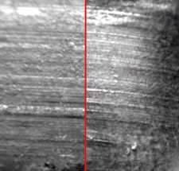
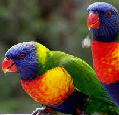
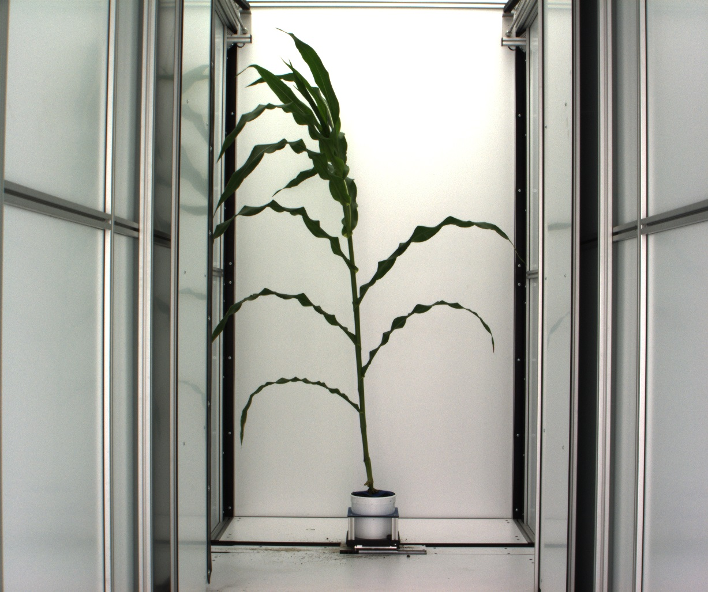
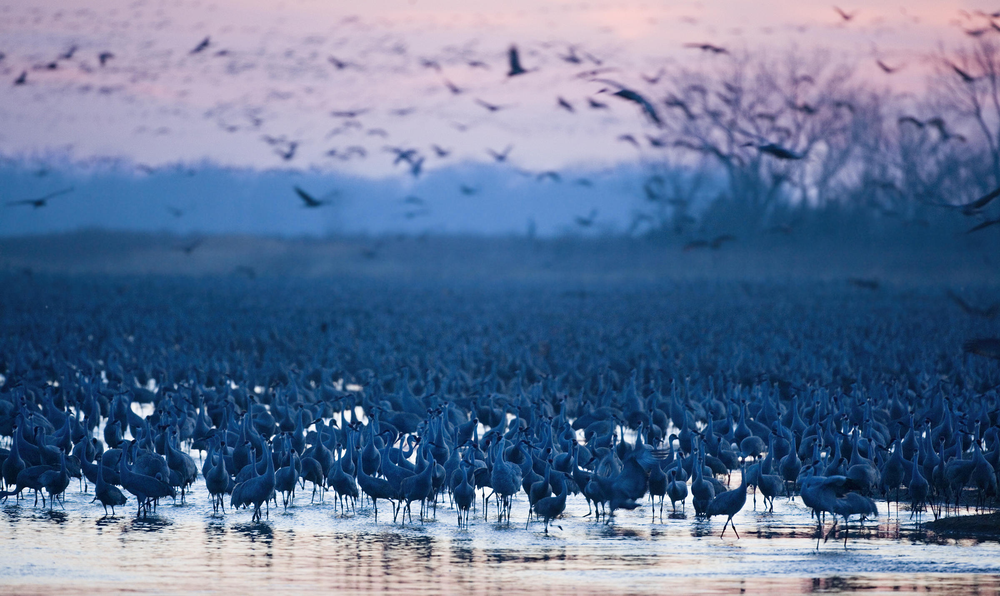
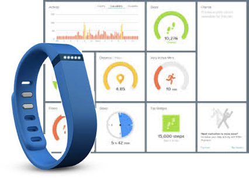

## Data Acquisition and Exploratory Data Analysis


## What is this course about?

* Data Acquisition
    + data ingestion: txt files, data bases, web sites, other (binary) sources
    + ethical issues
* Data Exploration
    + numerical and graphical summaries
    + types of graphics and good visualization practices
    + (simple) modeling
    
## What is this course about? (cont'd)
    
* Data Management
    + Pipeline for data analysis: filtering, transformation, aggregation
    + data (re-)shaping
    + normal forms of data
* Communicating Findings
    + writing reports 
    + web-based applets
* Reproducibility/Repeatability of Findings
    

## Data comes in a lot of different formats

__as sound, Example 1__


```{r}
library(tuneR)
ilr_class1 <- readWave("data/i-like-r.wav")
str(ilr_class1)
```


##

__as sound, Example 2__


```{r}
library(tuneR)
ilr_class2 <- readWave("data/music.wav")
str(ilr_class2)
```
[What are the outputs?](https://cran.r-project.org/web/packages/tuneR/tuneR.pdf)

## 

__Compare two datasets__

```{r, echo =FALSE, cache = TRUE, message=FALSE, warning = FALSE, fig.height = 1.5, fig.width = 8}
ilr_df1 <- data.frame(left=ilr_class1@left, right=ilr_class1@right)
ilr_df1$time <- 1:nrow(ilr_df1)
library(tidyverse)
ilr_df1 %>% ggplot(aes(time, right)) + geom_line()
```

Length of Example 1: `r nrow(ilr_df1)`

```{r, echo =FALSE, cache = TRUE, message=FALSE, warning = FALSE, fig.height = 1.5, fig.width = 8}
ilr_df2 <- data.frame(left=ilr_class2@left[1 : nrow(ilr_df1)], right=ilr_class2@right[1 : nrow(ilr_df1)])
ilr_df2$time <- 1:nrow(ilr_df2)
ilr_df2 %>% ggplot(aes(time, right)) + geom_line()
```

Length of chopped Example 2: `r nrow(ilr_df2)`

## Data comes in a lot of different formats

__as image__

 \ \ \ \ \ 
 \ \ \ \ \ 
   



##

```{r, message=FALSE}
library(jpeg)
img <- readJPEG("data/imgres.jpg")
str(img)
```

```{r, echo = FALSE, message = FALSE, cache= TRUE, fig.width=9, fig.height=3}
img_df <- data.frame(expand.grid(y = 1:dim(img)[1], x = 1:dim(img)[2]))
img_df$red <- as.numeric(img[,,1])
img_df$green <- as.numeric(img[,,2])
img_df$blue <- as.numeric(img[,,3])
p1 <- qplot(data=img_df, geom="tile", x =x, y=-y, fill = red) + xlab("") +ylab("") + scale_fill_gradient(low="white", high = "red") + theme(legend.position="none")
p2 <- qplot(data=img_df, geom="tile", x =x, y=-y, fill = green) + xlab("") +ylab("") + scale_fill_gradient(low="white", high = "green")+ theme(legend.position="none")
p3 <- qplot(data=img_df, geom="tile", x =x, y=-y, fill = blue) + xlab("") +ylab("") + scale_fill_gradient(low="white", high = "blue")+ theme(legend.position="none")
library(gridExtra)
grid.arrange(p1,p2,p3, nrow=1)
```

... what kind of birds are [these](http://www.theradzoo.com/meet-the-animals/birds/rainbow-lorikeet/)?


## Data comes in a lot of different formats

__in a monitoring device__



# ... we will be using R for that!

## R is ...

* with python most commonly used data science language (see [kdnuggets](http://www.kdnuggets.com/2017/05/poll-analytics-data-science-machine-learning-software-leaders.html) survey)
* __Free__ to use, __open source__ so you can see what code is doing to your data
* __Extensible__: Over 10000 user contributed add-on packages currently on CRAN! Bioconductor has more than 1300 packages, and many researchers provide packages through github.
* __Powerful__
    * With the right tools, get more work done, faster.
* __Flexible__
    * Not a question of _can_, but _how_.

```{r, eval = FALSE, echo = FALSE}
devtools::install_github("metacran/crandb")
pkgs <- crandb::list_packages(limit = 999999)
length(pkgs)
# [1] 12004
```

## at the end of the course you will ...

- be able to acquire and read data in different formats and from different sources
- know the basic programming principles of R
- be able to implement a basic data pipeline
- be able to do a data exploration
- visualize data in appropriate forms
- communicate your findings in a reproducible form as report and/or web-app


## Syllabus

Full syllabus is available from Canvas.

### Suggested reading:
- Garrett Grolemund and Hadley Wickham: *[R for Data Science](http://r4ds.had.co.nz/)*
- Garrett Grolemund: *[Hands-On Programming with R](https://www.amazon.com/dp/1449359019/ref=cm_sw_su_dp)*
- Hadley Wickham: *[ggplot2: Elegant Graphics for Data Analysis](https://www.amazon.com/ggplot2-Elegant-Graphics-Data-Analysis/dp/0387981403)*
- Yihui Xie: *Dynamic Documents with R and knitr*

### Course website: 
- Canvas: materials, assignments, code and grading
- https://yumouqiu.github.io/DS202-Spring2023/: lectures

## Grades

| Component | Weight |
|:-- | --:|
| Homework | 35% |
| Midterm | 30% |
| Final Project | 35% |


## In-class practice

- in-class coding practice
- data analysis: during class time on every other Thursday (starting for the second week of class) 


## Homework

- homework will be posted every week.
- homework assignments revise what we covered, plus synthesize some new information.
- plan to spend about 3-4h on each assignment.

## Midterm

- programming exam.
- limited time.
- open book, open note, open internet (no direct help from anyone else).
- tentatively scheduled before the Spring break.
- sample exams will be posted as we get closer to the date.

<!--- ## Mini-project

- team-based project (3-4 members).
- data exploration of a given data set. 
- your part: lay out data exploration and write up report of findings.
- scope: slightly bigger homework.
--->

## Final project

- no final exam
- several stages:
    * identify topic and data set
    * identify line of inquiry
    * report findings in report or shiny app


## Getting Help

There's lots of ways to get help in case you are stuck:


(1) Google is your friend! in particular, stackoverflow and R help are usually great resources,
(2) ask a team member,
(3) write email to the instructor or the TA with your question

## Asking a good question

is a learned and valuable skill!

Have a look at:

- stackoverflow's [Asking a good question](http://stackoverflow.com/help/how-to-ask)
- R's [Posting guidelines](https://www.r-project.org/posting-guide.html)

## Asking a good question

is a learned and valuable skill!

Have a look at:

- stackoverflow's [Asking a good question](http://stackoverflow.com/help/how-to-ask)
- R's [Posting guidelines](https://www.r-project.org/posting-guide.html)

## What do you know already?

- excel?
- a programming language? 
- SAS? R? R markdown?
- database theory? what is a third normal form?

## What is this class about?

- very data centric
- collecting data becomes "easier and easier"  
- For example: I'd like to know what you are interested in

## Easy collection of data

- **Sports** e.g. Baseball salaries and performance
- **Crime data** (incl. type, time, place, demographics etc.)
- **Health** e.g. fitness statistics, or disease rates, or health care costs
- **Movies** e.g. ratings/box office revenues from IMDB
Climate/Weather Data
- **Travel data**, e.g. US flights
- **Environmental Data**: Pollution, Fuel Economy, CO2 Emissions (Carbon Footprint)
- **Global Data**:  World Economy, Social indicators, ...


Anything else you can think of?


## Vote

Go to Wufoo Site to collect the survey:
https://www.wufoo.com/

## What is exploratory data analysis?

Typical data science project:

Typical cycle of a data science project


- exploration goes hand in hand with understanding
- our understanding of the world must be based on data

## An example: mind the gap!

Statistician Hans Rosling (1948 - 2017) presented [GapMinder at TED 2006](https://www.ted.com/talks/hans_rosling_the_best_stats_you_ve_ever_seen)

- preconceived notions are problematic
- up-to-date data helps us learn about the world

... let's try this out ...

## Your Turn {.white}


- <font color="white">Follow the link to open Gapminder tools at https://www.gapminder.org/tools/#_chart-type=bubbles</font>
- <font color="white">Recreate Hans Rosling's chart of life expectancy (y-axis) by fertility rate (x-axis) and move the slider over time.</font>
- <font color="white">Using this chart, can you find evidence for the AIDS epidemic in Africa? the civil war in Nigeria? the earth quake in Haiti?</font>
- <font color="white">How is income related to life expectancy?
</font>
- <font color="white">What else did you find? How much of this did you know before?</font>
