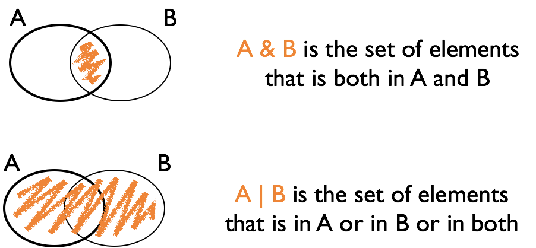

# Logical variables and Filters

## Logical vectors

- Vectors consisting of values `TRUE` and `FALSE`
- Very important!
- Usually created with a logical comparison
- `<, >, ==, !=, <=, >=`
- `x %in% c(1, 4, 3, 7)`
- `subset` or `dplyr::filter`

## Logical expressions

- `&` and `|` are the logical *and* and *or*
- `!` is the logical *not*
- use parentheses () when linking expressions to avoid mis-interpretation

## Logical Operations



## Your turn {.white}


<span style="color:white">
Define vector `a` to be `a <- c(1,15, 3,20, 5,8,9,10, 1,3)`

<span style="color:white">
Find the expression for the logical vector that is TRUE where `a` is:
</span>

- <span style="color:white">less than 20</span>
- <span style="color:white">squared value is at least 100 or less than 10</span>
- <span style="color:white">equals 1 or 3</span>
- <span style="color:white">even <br>
  Hint: have a look at the help for the operator `%%`</span>
  
  
```{r}
a = c(1,15, 3,20, 5,8,9,10, 1,3)

a < 20

(a^2 >= 100) | (a^2 < 10)

a %in% c(1, 3)

(a %% 2) == 0
```

## `filter {dplyr}`

`filter` is a command of package `dplyr`

`filter(data, ...)` finds subset of `data` where conditions specified by logical expression in `...` are true, e.g. `filter(fbi, Year == 2014)`
`filter(fbi, Type == "Larceny.theft", State %in% c("Iowa", "Minnesota"))`

multiple expressions are combined by a logical and `&`

Note that the command `subset` works very similarly.

Caution! there is another function called `filter` in the `stats` package. Use `::` to make sure you use the right one: `dplyr::filter`

## Your turn {.white}


- <span style="color:white">Get a subset of all crimes in Iowa, Plot incidences/rates for one type of crime over time.</span>
- <span style="color:white">Get a subset of all crimes in 2009. Plot the number or rate for one type of crime by state.</span>
- <span style="color:white">Get a subset of the data that includes number of homicides for the last five years. Find the rate of homicides, extract all states that have a rate of greater than 90% of the rates across all states, and plot (Hint: `?quantile`).</span>

<span style="color:white">Extra credit (1 point): submit your code (regardless of whether it works or not) in Canvas (yourturn-sept18).

```{r, eval = FALSE, echo = FALSE}
library(tidyverse)
library(classdata)

crime.IA = dplyr::filter(fbiwide, State == "Iowa")
ggplot(data = crime.IA, aes(x = Year, y = Legacy.rape)) + geom_point()

crime.2009 = dplyr::filter(fbiwide, Year == 2009)
ggplot(data = crime.2009, aes(x = State)) + geom_bar(aes(weight = Legacy.rape)) + coord_flip()

fbi.2009 = dplyr::filter(fbi, Year == 2009)
ggplot(data = fbi.2009, aes(x = Abb)) + geom_bar(aes(weight = Count, fill = Type)) + coord_flip()

crime.last5 = dplyr::filter(fbiwide, Year %in% c(2010 : 2014))
crime.last5$Murder.rate = crime.last5$Murder / crime.last5$Population*100000
quantile(crime.last5$Murder.rate, 0.9)
out = dplyr::filter(crime.last5, Murder.rate > quantile(crime.last5$Murder.rate, 0.9))
out[, c(1 : 3)]
```


## Updating elements in a vector

You can take a subset and update the original data:
```{r}
a <- 1:4
a

a[2:3] <- 0
a

replace(a, a == 0, -1)
```

Very useful in combination with logical subsetting


## Updating elements in a data set

data sets and their parts can be used as rhs of an assignment:

```{r}
library(classdata)

# introduces new variable in the data set fbiwide
fbiwide$murder.rate <- fbiwide$Murder/fbiwide$Population*100000

names(fbiwide)
```

if that variable exists before, it is being over-written/updated

## Your turn {.white}


<span style="color:white">The gapminder data we originally worked with is available [here](https://stat480-at-isu.github.io/materials/01_collaborative-environment/data/gapminder-5060.csv). It is also on Canvas. </span>

- <span style="color:white">`read.csv` helps you read the 'csv' file. Store the result in an object.</span>
- <span style="color:white">use `?read.csv` to see the help document.</span>
- <span style="color:white">What format does the object have?</span>
- <span style="color:white">Replace the problematic value in life expectancy for Canada in 1957  by 69.96. </span>

```{r, eval = FALSE, echo = FALSE}
gapminder = read.csv("https://stat480-at-isu.github.io/materials/01_collaborative-environment/data/gapminder-5060.csv")
str(gapminder)

dplyr::filter(gapminder, country == "Canada" & year == 1957)

gapminder$lifeExp = replace(gapminder$lifeExp, gapminder$country == "Canada" & gapminder$year == 1957, 69.96)
dplyr::filter(gapminder, country == "Canada" & year == 1957)
```
