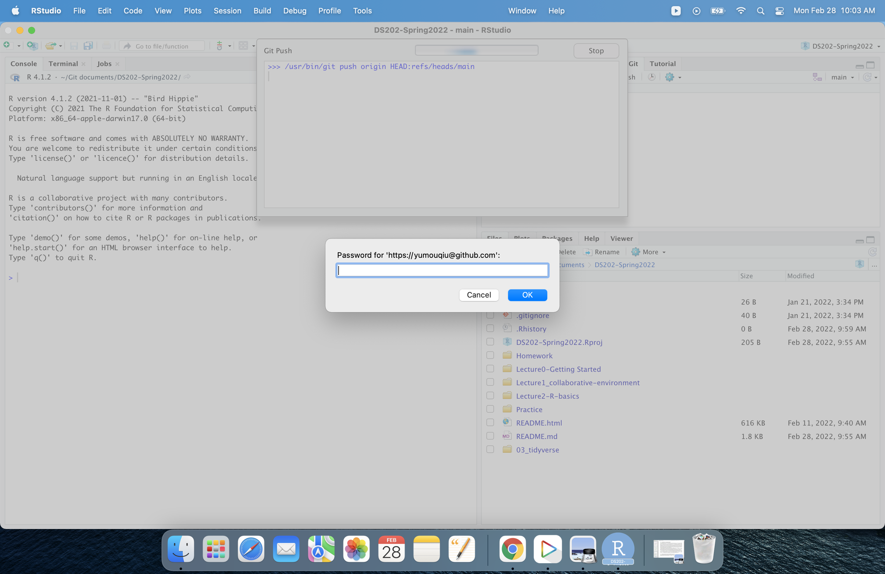
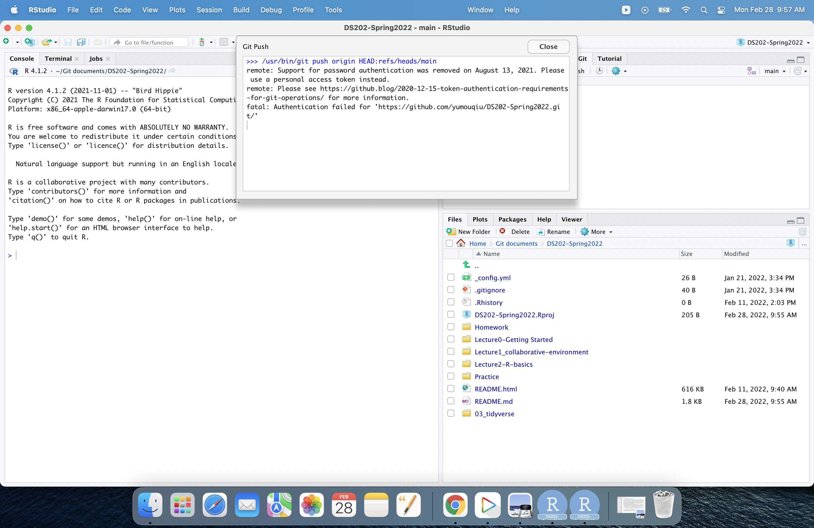

```{r setup, include=FALSE}
knitr::opts_chunk$set(echo = TRUE)
```

## { .white }


<p class="white" style="font-size:100px" align=center>
 In-class practice #3<br> Happiness!
</p>


## Outline

- Find your team members (You may work by yourown)
- Create a Github repository 
- Link the repository to Rstudio
- Do a data exploration (on happiness)
- Create an R markdown file that contains all code to read the data and create the plots
- Homework 7


## github repository

1. Log into github 
2. Create a repository called 'Homework 7'. Make sure to initialize the repo with a README file. 
3. Go into the settings of the repository and add your team members as collaborators

## Cloning the repo

1. Open RStudio, create a new repository using the option "Version Control", choose git as the option
2. From your github repository copy  the info you get when clicking on the green "Code" button
3. Paste the info into "Repository URL"
4. Create the project.

This clones the repository from github. 

Try push

## User name for github


## Password for github



## Error!



## Github token

From last year, we need to create a Github token to push local changes to the repository

See the link: https://docs.github.com/en/authentication/keeping-your-account-and-data-secure/creating-a-personal-access-token

Greate your token following the instructions

## Use token instead of password


You can now make local changes. 

## A first round of push and pull

Do these changes one at a time in your team. Don't try to do them all at once. 

1. Make a change to the README document.
2. Go to the 'Git' tab in the top right panel. 
3. All modified files will have an icon with a white 'M' on blue background.
4. Select the checkbox and click on 'Commit'. Write a commit message in the top right panel of the new dialog window. 
5. Hit the green arrow pointing up to 'push' changes to your github repo.
6. Hit the blue arrow pointing down to 'pull' changes from your github repo.

Commit, and pull, then push often. This will avoid conflicts.

## Background

The General Social Survey (GSS) has been run by NORC every other year since 1972 to keep track of current opinions across the United States. 

The package `productplots` contains a subset of this data, called `happy`.
You can access the data using the command

```{r}
data(happy, package="productplots")
head(happy)
```

## Updating and cleaning data

Unfortunately, the dataset ends in 2006. So today's activity is all about updating the dataset to the data from 2016.

An excerpt of the GSS data is available from our course website. 
Dowload the file [HAPPY.rds](https://github.com/yumouqiu/DS202-Spring2022/blob/main/03_tidyverse/data/HAPPY.rds?raw=true) and put the file into a folder called "data" next to your Rmd file. The following command is going to load the data into your R session:

```{r}
HAPPY <- readRDS("data/HAPPY.rds")
```

You can find a codebook with explanations for each of the variables at https://gssdataexplorer.norc.org/


## Part one (cleaning)

<p style="font-size:20px">
Answer each of the following questions using R code to get an answer. 
Write a separate code chunk for each variable, once all the data manipulation is done, show the values in a barchart or histogram and comment on the plot.
</p>

1. Data cleaning: the values "IAP", "DK" and "NA" all encode missing values. Replace all of these instances by the value `NA`. 
2. Check the type of the variable and cast into the right type (factor variable for categorical variables). For age, change "89 OR OLDER" to 89 and assume the variable should be numeric.
3. Bring all levels of factors into a sensible order. For marital you could e.g. order the levels according to average age. 

<p style="font-size:20px">
Save the final data set as RDS file (binary R data) using the command:`saveRDS`</p>

## Part two (individual exploration)

*Happiness!*

Investigate the relationship between happiness and two other variables in the data. Find a visualization that captures the relationship and write a paragraph to describe it. 

Each member should study a different question (choose different variables to investigate).

Upload your answers and the dataset to the repository. Discuss and refine answers as a team.

## Submission (Homework 7)

In Canvas, submit an RMarkdown file (and the knitted html document) with: 

  a. the names of all team members that worked on the document.
  b. a link to the github repo you were working in.
  c. code and answers to all of the questions.
  d. for the individual exploration, put the name of the team member beside each question you investigated.
  e. you can upload the data file, but you don't have to


Due date: Next Monday at 11:59 pm to submit the RMmarkdown file.


